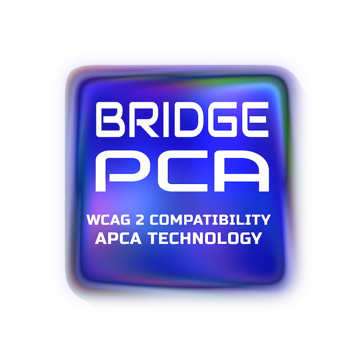
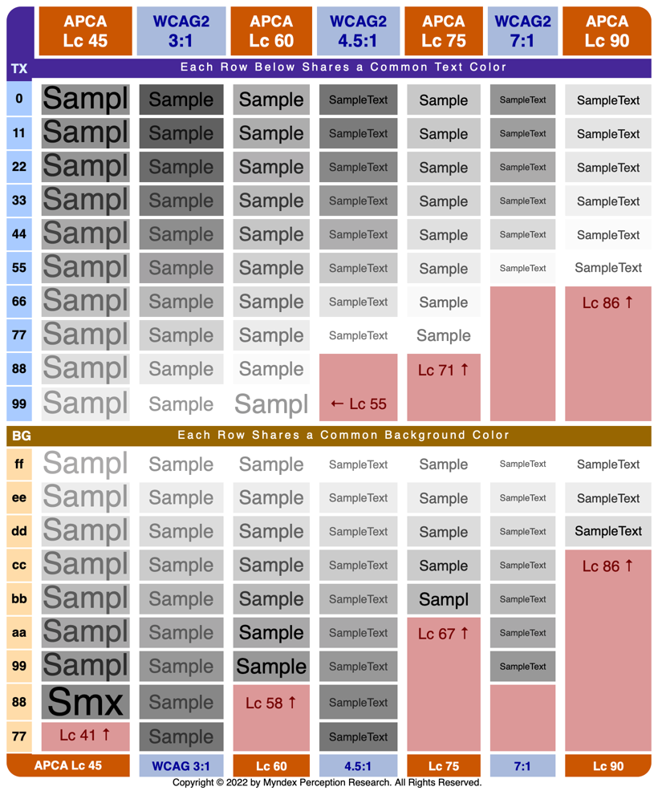

# Bridge PCA for WCAG\_2*
<p align="center">
 <br><br>

  <a href="https://github.com/Myndex/SAPC-APCA">
    
  </a> &nbsp;&nbsp;  
  <a href="https://npmjs.org/package/bridge-pca">
    
  </a> &nbsp;&nbsp;
  <a href="https://github.com/Myndex/bridge-pca/src/">
    
  </a> &nbsp;&nbsp;
  <a href="https://github.com/Myndex/bridge-pca/blob/master/LICENSE.md">
    
  </a> &nbsp;&nbsp;
</p>
<p align="center">
  <a href="https://github.com/Myndex/bridge-pca">
    
  </a> &nbsp;&nbsp;
  <a href="https://npmjs.org/package/bridge-pca">
    
  </a> &nbsp;&nbsp;
  <a href="https://twitter.com/MyndexResearch">
    
  </a> &nbsp;&nbsp;
  <a href="https://www.myndex.com/BPCA/">
    
  </a> &nbsp;&nbsp;    
</p>

## bridge-pca
**A Bridge for WCAG_2 contrast using APCA technology.**

### Bridge to the Advanced Perceptual Contrast Algorithm
Current Version: **0.1.4 4g** (w3) (public beta)

Bridge PCA is a contrast assessment method based on APCA & SAPC technology for predicting the perceived contrast between sRGB colors on a computer monitor. It has been developed as an assessment method to facilitate better readability while maintaining backwards compatibility with WCAG_2 contrast (1.4.3) accessibility standards relating to content for computer displays and mobile devices. The intention is to improve readability and understandability of content.

### _WCAG\_2 Drop N Go_
Current Version: 0.1.4 Jan 18, 2022

#### NEW in 0.1.3!! Now the [live tool][BPCAsite] reports both APCA LC values AND WCAG style ratios!.

Bridge-PCS is a "drop n go" replacement for WCAG_2 math, and it's super easy to convert to WCAG_2 ratios. Like APCA, BridgePCA reports results as Lc (Lightness Contrast), and they align like this:

Use the following conversions for AA and AAA:
- **Lc 60 exceeds WCAG 3:1**
- **Lc 75 exceeds WCAG 4.5:1**
- **Lc 90 exceeds WCAG 7:1**

**Large Font:** 24px (18pt) normal weight or 18.7px (14pt) bold, or larger.

\* <sub>*This is not an official guideline of the AGWG, and was developed indpenedently by Myndex to help cure the readability probelms with web-based content. It is nevertheless fully backwards compatible with the existing WGAC 2 guidelines and provides optional accessibility extensions to improve readability further. It is free for use with web-based content.*</sub>

-----
## WCAG\_2 Bridge-PCA _Enhanced SCs_
In addition, the following enhanced SCs can be added with Bridge-PCA to further improve readability guidance.

-----
### AA, Enhanced
***SHOULD***
- **Lc 15 (W 1.3:1)** Minimum for disabled elements (not hidden).
- **Lc 30 (W 1.8:1)** Minimum for incidental text such as placeholders.
- **Lc 45 (W 2:1)** Minimum for logotypes.

***SHALL***
- **Lc 60 (W 3:1)** Large font only, no body text. Non-text okay.
- **Lc 75 (W 4.5:1)** 16px minimum for body text, 12px minimum otherwise
- **Lc 90 (W 7:1)** 14px minimum body text, 10px minimum otherwise

***MAY***
- If the lightest color is *darker* than the equivalent of #d8d8d8, the minimum Lc value can be reduced by Lc 10, but lowered to no lower Lc 45. Does not apply to thin fonts.

-----
### AAA, Enhanced
***SHOULD***
- **Lc 30 (W 1.8:1)** Minimum for disabled elements (not hidden).
- **Lc 45 (W 2:1)** Minimum for incidental text such as placeholders.

***SHALL***
- **Lc 60 (W 3:1)** Minimum for logotypes and essential non-text.
- **Lc 75 (W 4.5:1)** Large font only, no body text.
- **Lc 90 (W 7:1)** 16px minimum for body text, 12px minimum otherwise

***MAY***
- **Lc 90 (W 7:1)** Suggested maximum for very large and bold elements.

-----
### Font Use, Enhanced
***SHOULD***
- Prefer a font with an x-height ratio of 0.56
    - Or adjust the minimum font size for fonts with smaller x-height ratios to make up the difference.
    - For instance the "large" font x-heights should be
        - 13.5px normal (24px font body)
        - 10.5px bold  (18.7px font body)
- Prefer a font no thinner than 300 weight
- Prefer a font no thicker than 700 weight

-----
### Comparison Chart
In this chart, we see that WCAG_2 contrast degrades losing readability as color pairs get darker, while APCA technology maintains readability across the visual range.



Additional Notes
-----
Unlike the main APCA, BridgePCA is all about "emulating" WCAG_2 contrast. So, BridgePCA is a like-for-like replacement of the quirky WCAG_2 contrast math.

Like APCA, BridgePCA reports results as Lc (Lightness Contrast). Conversion to WCAG_2 ratios:

- **Lc 60 exceeds WCAG 3:1**
- **Lc 75 exceeds WCAG 4.5:1**
- **Lc 90 exceeds WCAG 7:1**

***DIFFERENCES:*** for best results, send the text color to the text input of the tool. Bridge PCA is "polarity sensitive," even though WCAG_2 is not. For light text on a dark background, the result will have an R for "reverse" after the LC value. N means "normal".

**No Free Lunch:** while BridgePCA corrects the many false passes and improves readability, the cost is that there is reduced design flexibility due to the fact that to maintain backwards compatibility, some contrasts are forced higher than they actually need be.

BridgePCA has some minor internal adjustments to align with some of the more incorrect aspects of WCAG_2 contrast math. In order to be backwards compatible, BridgePCA will not forgive the false-fails of WCAG_2, but BridgePCA **will** correct the many false passes which vastly improves readability.

But if you need a standards compliant method that also improves readability this is it. If on the other hand you do not need to abide by the letter of any particular standard, you may want to consider the more flexible full APCA solution.

-----
## Developer QuickStart

```javascript
    import { APCAcontrast, sRGBtoY, displayP3toY, colorParsley } from 'bridge-pca';
```
### *Usage:*
Send rgba int **array** to sRGBtoY(), use the new colorParsley() if you need to parse a string first.

First color **must** be text, second color **must** be the background.

```javascript
    let textColor = [17,17,17,255];
    let backgroundColor = [232,230,221,255];
    let contrastLc = APCAcontrast( sRGBtoY( textColor ), sRGBtoY( backgroundColor ) );
```
### *Parsing Color Strings:*
If you need to parse, we've kept that, now called "colorParsley()" send it anything, it returns an rgba array. HSL is not implemented. Relative to the above example:

```js
    let textColor = colorParsley('#111111');
    let backgroundColor = colorParsley('e8e6dd');
```

The following are the available input types for colorParsley(), HSL is not implemented at the moment. All are automatically recognized:

### INPUT as STRINGS:
- **No Alpha**
    - ` '#abc' ` or ` 'abc' ` (interpreted as ` 'aabbcc' `)
    - ` '#abcdef' ` or ` 'abcdef' ` (hash is ignored)
    - ` 'rgb(123, 45, 67)' `
    - ` 'aquamarine' ` or ` 'magenta' ` (full CSS4 named colors list)

- **With Alpha** _(alpha is not presently calculated, and is assumed as fully opaque)_
    - ` '#abcf' ` or ` 'abcf' ` (interpreted as ` 'aabbccff' `)
    - ` '#123456ff' ` or ` '123456ff' ` (hash is ignored)
    - ` 'rgba(123, 45, 67,1.0)' `

### INPUT as NUMBER:
- **As hex**
    - ` 0xabcdef `
- **As integer**
    - ` 11259375 `

No alpha parsing for _numbers_ in part as there are big and little endian issues that need to be resolved.


### Parsing Removal
colorParsley() is now a separate package, and an optional dependency if you need parsing of strings.

-----
## EXTRAS
Additional documentation, including a plain language walkthrough, LaTeX math, and more are available [at the SAPC repo.](https://github.com/Myndex/SAPC-APCA)

### Current BPCA Constants ( 0.1.0 4g - W3 )
**These constants are for use with the web standard sRGB colorspace.**

```javascript
 // 0.98G-4g-W3 constants (W3 license only):

  Exponents =  { mainTRC: 2.4,       normBG: 0.56,       normTXT: 0.57,     revTXT: 0.62,     revBG: 0.65, };

  ColorSpace = { sRco: 0.2126729,    sGco: 0.7151522,    sBco: 0.0721750, };

  Clamps =     { blkThrs: 0.022,     blkClmp: 1.414,     loClip: 0.1,     deltaYmin: 0.0005, };
        
  Scalers =    { scaleBoW: 1.14,     loBoWoffset: 0.027, 
                 scaleWoB: 1.14,     loWoBoffset: 0.027, 
                 bridgeWoBfact = 0.1414,
                 bridgeWoBpivot = 0.84, };
````````

----- 
### [LIVE VERSION](http://www.myndex.com/BPCA/)
There's a working version with examples and reference material on [the BPCA site](http://www.myndex.com/BPCA/)

[BPCAsite]: https://www.myndex.com/BPCA/

[](https://github.com/Myndex)

### APCA is the Accessible Perceptual Contrast Algorithm_
## THE REVOLUTION WILL BE READABLE™

