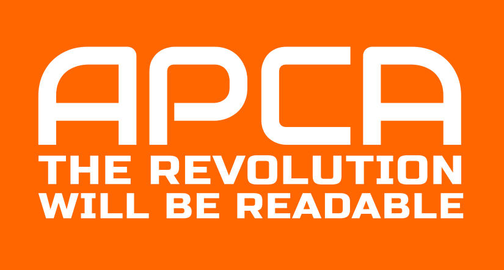

<p align="center">
 <br><br>
    
  <a href="https://github.com/Myndex/SAPC-APCA">
    
  </a> &nbsp;&nbsp;  
  <a href="https://npmjs.org/package/bridge-pca">
    
  </a> &nbsp;&nbsp;
  <a href="https://github.com/Myndex/bridge-pca/src/">
    
  </a> &nbsp;&nbsp;
  <a href="https://github.com/Myndex/bridge-pca/blob/master/LICENSE.md">
    
  </a> &nbsp;&nbsp;
</p>
<p align="center">
  <a href="https://github.com/Myndex/bridge-pca">
    
  </a> &nbsp;&nbsp;
  <a href="https://npmjs.org/package/bridge-pca">
    
  </a> &nbsp;&nbsp;
  <a href="https://twitter.com/MyndexResearch">
    
  </a> &nbsp;&nbsp;
  <a href="https://github.com/Myndex/SAPC-APCA">
    
  </a> &nbsp;&nbsp;    
</p>

# Bridge PCA for WCAG\_2
## bridge-pca
A Bridge for WCAG\_2 contrast using APCA technology -- this repositiory is licensed to the W3/AGWG per the collaborative agreement.

### Bridge to the Advanced Perceptual Contrast Algorithm

Current Version: **0.1.0 4g** (w3) _betafish_

Bridge PCA is a contrast assessment method based on APCA & SAPC technology for predicting the perceived contrast between sRGB colors on a computer monitor. It has been developed as an assessment method to facilitate better readability while maintaining backwards compatibility with WCAG_2 contrast (1.4.3) accessibility standards relating to content for computer displays and mobile devices. The intention is to improve readability and understandability of content.

## QuickStart

```javascript
    import { APCAcontrast, sRGBtoY, displayP3toY, colorParsley } from 'bridge-pca';
```
### *Usage:*
Send rgba int **array** to sRGBtoY(), use the new colorParsley() if you need to parse a string first.

First color **must** be text, second color **must** be the background.
```javascript
    let textColor = [17,17,17,255];
    let backgroundColor = [232,230,221,255];
    let contrastLc = APCAcontrast( sRGBtoY( textColor ), sRGBtoY( backgroundColor ) );
```

If you need to parse, we've kept that, now called "colorParsley()" send it anything, it returns an rgba array. HSL is not implemented. Relative to the above example:

```javascript
    let textColor = colorParsley('#111111');
    let backgroundColor = colorParsley('e8e6dd');
```


The following are the available input types for colorParsley(), HSL is not implemented at the moment. All are automatically recognized:

### INPUT as STRINGS:
- **No Alpha**
    - ` '#abc' ` or ` 'abc' ` (interpreted as ` 'aabbcc' `)
    - ` '#abcdef' ` or ` 'abcdef' ` (hash is ignored)
    - ` 'rgb(123, 45, 67)' `
    - ` 'aquamarine' ` or ` 'magenta' ` (full CSS4 named colors list)

- **With Alpha** _(alpha is NOT presently calculated, and assumed as fully opaque)_
    - ` '#abcf' ` or ` 'abcf' ` (interpreted as ` 'aabbccff' `)
    - ` '#123456ff' ` or ` '123456ff' ` (hash is ignored)
    - ` 'rgba(123, 45, 67,255)' `

### INPUT as NUMBER:
- **As hex**
    - ` 0xabcdef `
- **As integer**
    - ` 11259375 `

No alpha parsing for _numbers_ in part as there are big and little endian issues that need to be resolved.


 
### Parsing Removal
in the src folder .js file, there is a ` /*/ ` type code toggle you can disable the entire set of parsing functions before minimizing. this changes the import to:

```javascript
             // import with parsing off:
    import { APCAcontrast, sRGBtoY, displayP3toY } from 'bridge-pca';
```


### Font Use

Unlike the main APCA, BridgePCA is all about "emulating" WCAG\_2 contrast.

So, BridgePCA is a like-for-like replacement of the faulty WCAG\_2 contrast math.

DIFFERENCES: for best use, do not switch polarity. Bridge PCA is polarity sensitive, even though WCAG\_2 is not. For light text on a dark background, the result will be a negative number — use the absolute value (ignore the minus sign).

Like APCA, BridgePCA reports results as Lc (Lightness Contrast) but the conversion to WCAG\_2 ratios is trivial:

Lc 60 exceeds WCAG 3:1
Lc 75 exceeds WCAG 4.5:1
Lc 90 exceeds WCAG 7:1

BridgePCA has some minor internal adjustments to align with some of the incorrect aspects of WCAG\_2 contrast math. In order to be backwards compatible, BridgePCA will not forgive the false-fails of WCAG\_2 but BridgePCA will correct the many false passes.

**No Free Lunch:** while BridgePCA corrects the many false passes and improve readability, the cost is that there is reduced design flexibility due to the fact that to maintain backwards compatibility, some contrasts are forced higher than they actually need be.

But if you need a standards compliant method that also improves readability this is it. If on the other hand you do not need to abide by the letter of any particular standard, you may want to consider the more flexible full APCA solution.


-----
## EXTRAS
Additional documentation, including a plain language walkthrough, LaTeX math, and more are available [at the SAPC repo.](https://github.com/Myndex/SAPC-APCA)

### Current BPCA Constants ( 0.1.0 4g - W3 )
**These constants are for use with the web standard sRGB colorspace.**
```javascript
 // 0.98G-4g-W3 constants (W3 license only):
    
  Exponents =  { mainTRC: 2.4,       normBG: 0.56,       normTXT: 0.57,     revTXT: 0.62,     revBG: 0.65, };
  
  ColorSpace = { sRco: 0.2126729,    sGco: 0.7151522,    sBco: 0.0721750, };
    
  Clamps =     { blkThrs: 0.022,     blkClmp: 1.414,     loClip: 0.1,     deltaYmin: 0.0005, };
        
  Scalers =    { scaleBoW: 1.14,     loBoWoffset: 0.027, 
                 scaleWoB: 1.14,     loWoBoffset: 0.027, 
                 bridgeWoBfact = 0.1414,
                 bridgeWoBpivot = 0.84, };	
```    

----- 
### [LIVE VERSION][BPCAsite]
There (will be soon)) a working version with examples and reference material on [the BPCA site][BPCAsite]

[BPCAsite]: https://www.myndex.com/BPCA/

[](https://github.com/Myndex)

### APCA is the _Advanced Perceptual Contrast Algorithm_
## THE REVOLUTION WILL BE READABLE™


