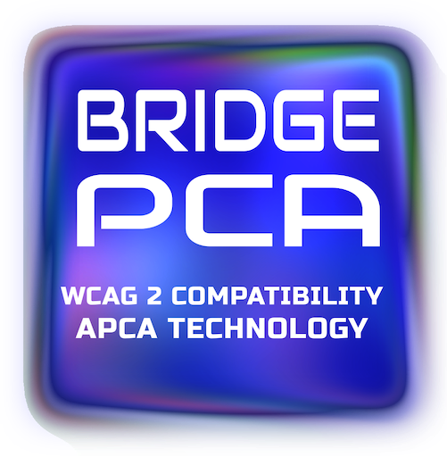
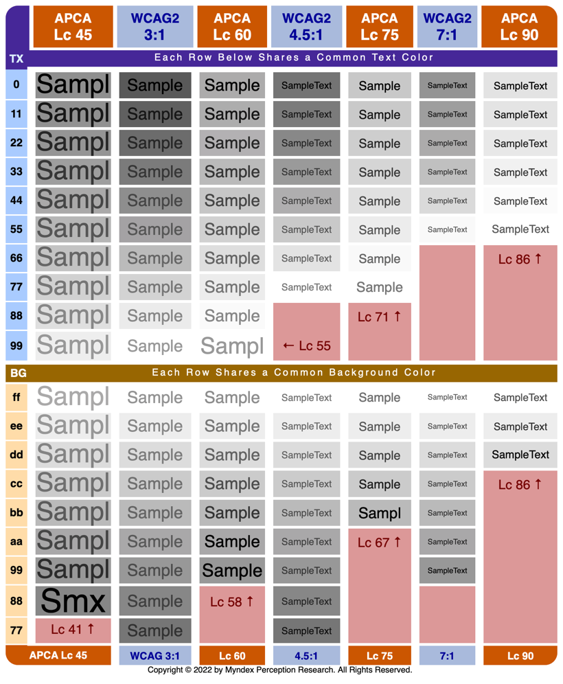

# Bridge PCA for WCAG 2*
<p align="center">
 <br><br>

  <a href="https://github.com/Myndex/SAPC-APCA">
    
  </a> &nbsp;&nbsp;  
  <a href="https://npmjs.org/package/bridge-pca">
    
  </a> &nbsp;&nbsp;
  <a href="https://github.com/Myndex/bridge-pca/src/">
    
  </a> &nbsp;&nbsp;
  <a href="https://github.com/Myndex/bridge-pca/blob/master/LICENSE.md">
    
  </a> &nbsp;&nbsp;
</p>
<p align="center">
  <a href="https://github.com/Myndex/bridge-pca">
    
  </a> &nbsp;&nbsp;
  <a href="https://npmjs.org/package/bridge-pca">
    
  </a> &nbsp;&nbsp;
  <a href="https://twitter.com/MyndexResearch">
    
  </a> &nbsp;&nbsp;
  <a href="https://www.myndex.com/BPCA/">
    
  </a> &nbsp;&nbsp;    
</p>

## bridge-pca
**A Bridge for WCAG 2 contrast using APCA technology.**
_NPM Install:_ ` npm i bridge-pca `

## Why BridgePCA??
BridgePCA was developed to address some concerns raised by some regarding legal requirements. While actual accessibility is what is legal, WCAG&nbsp;2 misses the mark as far as the contrast math is concerned. The algorithm for 1.4.3 and 1.4.11 grossly over rates contrast for dark colors, while underrating light color pairs. There is an unfortunate implication regarding mathematics more than accessibility.

APCA and the [APCA Readability Criterion](https://readtech.org/ARC/) promotes _**actual**_ accessibility whereas WCAG&nbsp;2 contrast does not. That said, WCAG&nbsp;2 contrast's over rating of dark colors is an easy fix, and APCA directly exceeds WCAG&nbsp;2 both mathematically and in terms of actual accessibility. However WCAG&nbsp;2 rejects color pairs involving white, even though they are far more readable than the same color paired with black that WCAG&nbsp;2 passes. APCA, being perceptually uniform, correctly passes the lighter colors that are better for CVD, while rejecting the colors that are worse—but this leads to a mathematical conundrum.

Some have claimed that you have to match the math to be legal, while forgoing actual accessibility. This is not strictly true in any case we are aware of—WCAG&nbsp;2 contrast SCs have not won a case on merits in a court of law. Still, caution is good as the landscape is changing. And Bridge&nbsp;PCA helps here.

BridgePCA maintains backwards compatibility to the flawed WCAG&nbsp;2 contrast but at the loss of some useful flexibility. In other words, it rejects some useable colors all in the name of fitting within the awkward math profile of WCAG&nbsp;2 contrast. It's a way to "force fit" WCAG&nbsp;2  guidelines into something less harmful. But because WCAG_2 contrast ignores spatial characteristics (such as line thickness) as the primary driver of contrast, Bridge&nbsp;PCA is restricted from relaxing contrast on low-spatial frequency elements, which is also specifically needed, yet missing in WCAG&nbsp;2.

For instance, WCAG&nbsp;2 SC 1.4.11 is not supported by any actual science, and makes some logical leaps, ignoring the primary drivers of contrast perception. Moreover, WCAG&nbsp;2 contrast _results_ can be grossly insufficient, or just barely enough, or much more than needed, all depending on context and use-cases — unfortunately WCAG&nbsp;2 contrast ignores context and use-cases.

### Make no mistake: any controversy is over badly conceived math, not actual accessibility.

As such, while the APCA values (2021 with G4g4 constants) are visible, the "WCAG 2" equivalent values are usable as a drop in replacement. As colors get darker, you'll notice that the WCAG 2 values do not rise like the "official" algo, but remain in keeping with perceptual uniformity.


      

### Bridge to the Advanced Perceptual Contrast Algorithm
Current Version: **0.1.5 4g** (w3) (public beta)

Bridge PCA is a contrast assessment method based on APCA & SAPC technology for predicting the perceived contrast between sRGB colors on a computer monitor. It has been developed as an assessment method to facilitate better readability while maintaining backwards compatibility with WCAG_2 contrast (1.4.3 & 1.4.11) accessibility standards relating to content for computer displays and mobile devices. The intention is to improve readability and understandability of content.

### _WCAG\_2 Drop N Go_
Current Version: 0.1.5 April 14, 2022

NEW: Improved WCAG 2 ratios.

Bridge-PCS is a "drop n go" replacement for WCAG_2 math, and it's super easy to convert to WCAG_2 ratios. Like APCA, BridgePCA reports results as Lc (Lightness Contrast), and they align like this:

Use the following conversions for AA and AAA:
- **Lc 60 always exceeds WCAG 3:1**
- **Lc 75 always exceeds WCAG 4.5:1**
- **Lc 90 always exceeds WCAG 7:1**

As you can see clearly, there is no problem with backwards compatibility, but the reality is that these values can be too much contrast in a number of use cases. So it is just a matter of guidelines. The WCAG&nbsp;2 math does not allow for flexible guidelines—and that leaves us with a math discrepancy if we want to accommodate use cases and visual hierarchies. 

**Large Font:** 24px (18pt) normal weight or 18.7px (14pt) bold, or larger.

\* <sub>*This is not an official guideline of the AGWG, and was developed indpenedently by Myndex to help cure the readability probelms with web-based content. It is nevertheless fully backwards compatible with the existing WCAG 2 guidelines and provides optional accessibility extensions to improve readability further. It is free for use with web-based content.*</sub>

-----
## WCAG\_2 Bridge-PCA _Enhanced SCs_
In addition, the following enhanced SCs can be added with Bridge-PCA to further improve readability guidance.

-----
### AA, Enhanced
***SHOULD***
- **Lc 15 (W 1.3:1)** Minimum for disabled elements (not hidden).
- **Lc 30 (W 1.8:1)** Minimum for incidental text such as placeholders.
- **Lc 45 (W 2:1)** Minimum for logotypes.

***SHALL***
- **Lc 60 (W 3:1)** Large font only, no body text. Non-text okay.
- **Lc 75 (W 4.5:1)** 16px minimum for body text, 12px minimum otherwise
- **Lc 90 (W 7:1)** 14px minimum body text, 10px minimum otherwise

***MAY***
- If the lightest color is *darker* than the equivalent of #d8d8d8, the minimum Lc value can be reduced by Lc 10, but lowered to no lower Lc 45. Does not apply to thin fonts.

-----
### AAA, Enhanced
***SHOULD***
- **Lc 30 (W 1.8:1)** Minimum for disabled elements (not hidden).
- **Lc 45 (W 2:1)** Minimum for incidental text such as placeholders.

***SHALL***
- **Lc 60 (W 3:1)** Minimum for logotypes and essential non-text.
- **Lc 75 (W 4.5:1)** Large font only, no body text.
- **Lc 90 (W 7:1)** 16px minimum for body text, 12px minimum otherwise

***MAY***
- **Lc 90 (W 7:1)** Suggested maximum for very large and bold elements.

-----
### Font Use, Enhanced
***SHOULD***
- Prefer a font with an x-height ratio of 0.56
    - Or adjust the minimum font size for fonts with smaller x-height ratios to make up the difference.
    - For instance the "large" font x-heights should be
        - 13.5px normal (24px font body)
        - 10.5px bold  (18.7px font body)
- Prefer a font no thinner than 300 weight
- Prefer a font no thicker than 700 weight

-----
### Comparison Chart
In this chart, we see that WCAG&nbsp;2 contrast degrades losing readability as color pairs get darker, while APCA technology maintains readability across the visual range.



Additional Notes
-----
Unlike the main APCA, BridgePCA is all about "emulating" WCAG&nbsp;2 contrast as a drop in replacement, fixing what can be fixed without incurring WCAG&nbsp;2's false rejections. Thus, BridgePCA is a like-for-like replacement of the quirky WCAG&nbsp;2 contrast math.

Like APCA, BridgePCA reports results as Lc (Lightness Contrast). Conversion to WCAG&nbsp;2 ratios:

- **Lc 60 always exceeds WCAG 3:1**
- **Lc 75 always exceeds WCAG 4.5:1**
- **Lc 90 always exceeds WCAG 7:1**

***DIFFERENCES:*** for best results, send the text color to the text input of the tool. Bridge PCA is "polarity sensitive," even though WCAG&nbsp;2 is not. For light text on a dark background, the Lc result will be negative screen.¹

**No Free Lunch:** while BridgePCA corrects the many false passes and improves readability, the cost is that there is reduced design flexibility due to the fact that to maintain backwards compatibility, some contrasts are forced higher than they actually need be.

One of the areas that the WCAG 2 contrast is wrong, relates to users with CVD (color vision deficiency sometimes referred to as colorblind). WCAG&nbsp;2 excludes many colors like reds and oranges against white which are good for CVD especially protanopia, while paradoxically passing those same colors against black, which is substantially worse for CVD.

The <a href="https://apcacontrast.com">full APCA</a> correctly rejects the color combinations that are detrimental to CVD, and passes the colors that are better for CVD—the only area where APCA passes colors that WCAG 2 rejects, are the very color pairs that are better for CVD.

BridgePCA has some minor internal adjustments to align with some of these more incorrect aspects of WCAG&nbsp;2 contrast math, namely the lighter colored pairs. In order to be backwards compatible, BridgePCA will not forgive the false-fails of WCAG&nbsp;2, but BridgePCA **will** correct the many false passes which vastly improves readability.

Nevertheless if you need a "standards compliant" method that also improves readability this is it. If on the other hand you do not need to abide by the letter of any particular standard, you may want to consider the more flexible full APCA solution.

-----
## Developer QuickStart

```javascript
    import { APCAcontrast, sRGBtoY, displayP3toY, colorParsley } from 'bridge-pca';
```
### *Usage:*
Send rgba int **array** to sRGBtoY(), use the new colorParsley() if you need to parse a string first.

First color **must** be text, second color **must** be the background.

```javascript
    let textColor = [17,17,17,255];
    let backgroundColor = [232,230,221,255];
    
    let txtY = sRGBtoY( TEXTcolor );
    let bgY = sRGBtoY( BACKGNDcolor );
    z
    let contrastLc = BPCAcontrast( txtY, bgY );
    let wcag2ratio = bridgeRatio( contrastLc, txtY, bgY );

```
### *Parsing Color Strings:*
If you need to parse, we've kept that, now called "colorParsley()" send it anything, it returns an rgba array. HSL is not implemented. Relative to the above example:

```js
    let textColor = colorParsley('#111111');
    let backgroundColor = colorParsley('e8e6dd');
```

The following are the available input types for colorParsley(), HSL is not implemented at the moment. All are automatically recognized:

### INPUT as STRINGS:
- **No Alpha**
    - ` '#abc' ` or ` 'abc' ` (interpreted as ` 'aabbcc' `)
    - ` '#abcdef' ` or ` 'abcdef' ` (hash is ignored)
    - ` 'rgb(123, 45, 67)' `
    - ` 'aquamarine' ` or ` 'magenta' ` (full CSS4 named colors list)

- **With Alpha** _(alpha is not presently calculated, and is assumed as fully opaque)_
    - ` '#abcf' ` or ` 'abcf' ` (interpreted as ` 'aabbccff' `)
    - ` '#123456ff' ` or ` '123456ff' ` (hash is ignored)
    - ` 'rgba(123, 45, 67,1.0)' `

### INPUT as NUMBER:
- **As hex**
    - ` 0xabcdef `
- **As integer**
    - ` 11259375 `

No alpha parsing for _numbers_ in part as there are big and little endian issues that need to be resolved.


### Parsing Removal
colorParsley() is now a separate package, and an optional dependency if you need parsing of strings.

-----
## EXTRAS
Additional documentation, including a plain language walkthrough, LaTeX math, and more are available [at the SAPC repo.](https://github.com/Myndex/SAPC-APCA)

### Current BPCA Constants ( 0.1.5 4g - W3 )
**These constants are for use with the web standard sRGB colorspace.**

```javascript
 // 0.98G-4g-W3 constants (W3 license only):

  Exponents =  { mainTRC: 2.4,       normBG: 0.56,       normTXT: 0.57,     revTXT: 0.62,     revBG: 0.65, };

  ColorSpace = { sRco: 0.2126729,    sGco: 0.7151522,    sBco: 0.0721750, };

  Clamps =     { blkThrs: 0.022,     blkClmp: 1.414,     loClip: 0.1,     deltaYmin: 0.0005, };
        
  Scalers =    { scaleBoW: 1.14,     loBoWoffset: 0.027, 
                 scaleWoB: 1.14,     loWoBoffset: 0.027, 
                 bridgeWoBfact: 0.1414,
                 bridgeWoBpivot: 0.84, };

// NEW for 0.1.5 for the bridgeRatio function
    const hiTrim = 0.0785;
    const loTrim = 0.0815;
    const trimThresh = 0.506;
````````

Note:
¹ Depending on the field, negative and positive contrast may have different meanings. In readability research, "screen contrast" is typically used, which means that negative is WoB, or White text on Black. In vision science studies, this same consition is more often called positive contrast. We are using negative screen contrast as the APCA guidelines are derived from modern readability research.

----- 
### [LIVE VERSION](https://www.bridgepca.com)
There's a working version with examples and reference material on [the BPCA site](https://www.bridgepca.com)

[BPCAsite]: https://www.bridgepca.com

[](https://github.com/Myndex)

### APCA is the _Accessible Perceptual Contrast Algorithm_
## THE REVOLUTION WILL BE READABLE™

